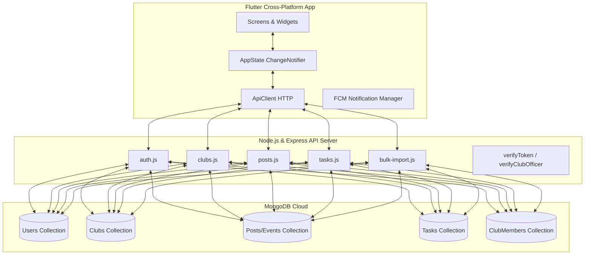

# Product Requirement Document (PRD): Club Connect

**Project Name:** Club Connect  
**Platform:** Cross-platform Mobile & Web (Flutter Frontend + Node.js/Express Backend)  
**Database:** MongoDB  
**Document version:** 1.0.0  
**Last Updated:** July 2026  

---

## 1. Product Vision & Executive Summary

### 1.1 Product Vision
**Club Connect** is a unified digital platform designed to bridge the gap between students, student-led clubs, faculty advisors, and institutional administrators. In large educational institutions, club activities, notifications, task delegations, and budget approvals are often fragmented across multiple chat apps, spreadsheets, and emails. Club Connect consolidates these workflows into a single mobile-first application, driving high engagement, smooth operations, and transparent approvals.

### 1.2 Problem Statement
- **Information Silos:** Students miss out on events and announcements because they are scattered across different group chats (WhatsApp, Discord) or physical bulletin boards.
- **Administrative Friction:** Club officers struggle to obtain faculty/advisor approvals for budgets and report submissions, leading to delays.
- **Project Tracking Hurdles:** Organizing tasks, assignees, and progress lists within clubs is manually managed and lacks transparency.
- **Manual Data Management:** Admins waste hours manually uploading student rosters, assigning faculty mentors, and configuring club details.

### 1.3 Key Value Propositions
- **Centralized Event & Feed Hub:** Live, categorized updates of all events and announcements on campus.
- **Transparent Workflows:** Built-in budget submittal/verification flows and activity reports for club officers and advisors.
- **Operational Taskboards:** A direct Kanban-style task system for internal club coordination.
- **Institutional Management Tools:** Robust admin dashboards supporting bulk imports and automated role assignments.

---

## 2. User Roles & Permission Matrix

Club Connect serves four distinct types of users, each mapped to specific permissions and access scopes:

| Role | Scope & Permissions | Key Use Cases |
| :--- | :--- | :--- |
| **Student (General User)** | Read-only access to feed; can like, RSVP, and view calendars. | View club directories, RSVP to events, view profiles, and update self-preferences. |
| **Club Officer** (President, Secretary, Treasurer, etc.) | High control within their designated club(s). Access to Officer Dashboard. | Post announcements/events, create & assign tasks, request budget approvals, submit reports. |
| **Faculty Advisor / Teacher** | Read & verify capabilities for assigned clubs. | Monitor club tasks/activity, verify event budgets, view student RSVP data. |
| **System Administrator** | Global override. Absolute read/write permissions across all clubs. | Create new clubs, assign officers/advisors, modify institutional settings, execute bulk imports. |

---

## 3. Core Modules & Feature Specifications

### 3.1 Authentication & Onboarding
- **Local Authentication:** Sign up and log in using an email and password.
- **One-Time Passcode (OTP):** Required during signup to verify institutional email addresses. Handled by an OTP mailer service.
- **Google OAuth Integration:** Allows fast login/signup using Google accounts. If the Google account is not yet registered, it requests additional signup fields.
- **Session Persistence:** Remembers user logins utilizing JSON Web Tokens (JWT) cached in local device storage.
- *Files involved:* [auth.js](file:///Users/shruti/Desktop/Club-Connect-App/server/routes/auth.js), [app_state.dart](file:///Users/shruti/Desktop/Club-Connect-App/lib/src/state/app_state.dart#L139-L300)

### 3.2 Club Discovery & Directory
- **Club Directory Screen:** Displays all active clubs, categorized by fields (e.g., Academic, Cultural, Sports, Technical).
- **Interactive Branding:** Custom colors, icons, and categories make club banners stand out.
- **Followers/Likes:** Students can "like" a club to subscribe to updates and show support.
- **Detailed Profiles:** Showcases club description, advisor names, president/secretary emails, social media URLs (WhatsApp, Instagram), and member lists.
- *Files involved:* [club.dart](file:///Users/shruti/Desktop/Club-Connect-App/lib/src/models/club.dart), [club_detail_screen.dart](file:///Users/shruti/Desktop/Club-Connect-App/lib/src/screens/club_detail_screen.dart), [clubs.js](file:///Users/shruti/Desktop/Club-Connect-App/server/routes/clubs.js)

### 3.3 Event Feed & Announcements
- **Interactive Feed:** Supports two post types: `event` and `announcement`.
- **Event Metadata:** Details include date, start/end times, location (online vs. offline), registration URL, WhatsApp group link, and response spreadsheet link.
- **RSVPs:** Students can quickly tap to RSVP to upcoming events, providing counts to organizers.
- **Calendar View:** A monthly visual grid of all scheduled events.
- *Files involved:* [post_item.dart](file:///Users/shruti/Desktop/Club-Connect-App/lib/src/models/post_item.dart), [posts.js](file:///Users/shruti/Desktop/Club-Connect-App/server/routes/posts.js), [monthly_calendar_screen.dart](file:///Users/shruti/Desktop/Club-Connect-App/lib/src/screens/monthly_calendar_screen.dart)

### 3.4 Operational & Financial Workflows
- **Budget Tracking:** Club secretaries can upload a receipt or budget sheet image.
- **Advisor Verification:** Designated advisors view and check off the budget as "Verified" inside the event details.
- **Activity Reports:** Allows officers to submit URLs to post-event documentation, registering who submitted it and when.
- **Attendance & Certificates:** Supports multiple session attendance logs and positioning configurations for generating digital participation certificates.
- *Files involved:* [Post.js](file:///Users/shruti/Desktop/Club-Connect-App/server/models/Post.js), [dashboard_screen.dart](file:///Users/shruti/Desktop/Club-Connect-App/lib/src/screens/dashboard_screen.dart)

### 3.5 Internal Task Management
- **Task Board:** A lightweight task tracker tailored per club.
- **Status Columns:** Cards grouped by status: `pending` (To-do), `in-progress` (Doing), and `completed` (Done).
- **Delegation:** Tasks can be assigned to specific club members via name/email.
- **Event Links:** Tasks can be associated directly with a parent event for easy context.
- *Files involved:* [Task.js](file:///Users/shruti/Desktop/Club-Connect-App/server/models/Task.js), [tasks.js](file:///Users/shruti/Desktop/Club-Connect-App/server/routes/tasks.js)

### 3.6 Communications & Notifications
- **Push Notifications:** Powered by Firebase Cloud Messaging (FCM). Syncs user device tokens upon login.
- **Automatic Triggers:** Alerts students immediately when club officers post announcements, schedule events, or assign tasks.
- *Files involved:* [Notification.js](file:///Users/shruti/Desktop/Club-Connect-App/server/models/Notification.js), [notifications.js](file:///Users/shruti/Desktop/Club-Connect-App/server/routes/notifications.js)

### 3.7 Administration & Institutional Configuration
- **Global Settings:** Modify institutional credentials and options.
- **Bulk Imports:** Upload CSV files to import student directories, teachers, or clubs in bulk.
- **Role Administration:** Admins can designate teachers, change officers, and manage active clubs.
- *Files involved:* [bulk-import.js](file:///Users/shruti/Desktop/Club-Connect-App/server/routes/bulk-import.js), [institution_settings_screen.dart](file:///Users/shruti/Desktop/Club-Connect-App/lib/src/screens/institution_settings_screen.dart)

---

## 4. Technical Architecture & Data Models

The app is built on a standard decoupled architecture:



### 4.1 Key Database Schemas

#### User Schema ([User.js](file:///Users/shruti/Desktop/Club-Connect-App/server/models/User.js))
Stores credential details, roles, liked clubs, profile settings, and FCM notification tokens.
```javascript
{
  email: { type: String, required: true, unique: true },
  password: { type: String, required: false },
  name: { type: String, required: true },
  authProvider: { type: String, enum: ['local', 'google'], default: 'local' },
  role: { type: String, default: 'user' },
  roles: [{ type: String }], // Array for multiple roles (admin, teacher, officer, etc.)
  managedClubs: [String], // Club IDs managed by teacher
  likedClubs: [String], // Club IDs followed by user
  fcmTokens: [String]
}
```

#### Club Schema ([Club.js](file:///Users/shruti/Desktop/Club-Connect-App/server/models/Club.js))
Stores branding configurations, category labels, member counts, and contact links.
```javascript
{
  name: { type: String, required: true },
  description: { type: String },
  category: { type: String, default: 'technical' },
  presidentEmail: { type: String },
  secretaryEmail: { type: String },
  treasurerEmail: { type: String },
  advisorEmail: { type: String },
  advisorName: { type: String },
  whatsappUrl: { type: String },
  instagramUrl: { type: String }
}
```

#### Post Schema ([Post.js](file:///Users/shruti/Desktop/Club-Connect-App/server/models/Post.js))
Consolidates event announcements, budgets, location info, and report details.
```javascript
{
  clubId: { type: ObjectId, ref: 'Club' },
  title: { type: String, required: true },
  content: { type: String },
  type: { type: String, enum: ['event', 'announcement'] },
  date: { type: Date },
  timeFrom: { type: String },
  timeTo: { type: String },
  location: { type: String },
  locationType: { type: String, enum: ['online', 'offline'] },
  registrationLink: { type: String },
  rsvps: [String], // User IDs or emails RSVP'd
  budgetImage: { type: String }, // Receipt/budget URL
  budgetVerified: { type: Boolean, default: false },
  reportUrl: { type: String },
  reportSubmittedByName: { type: String }
}
```

---

## 5. Development Roadmap & Future Enhancements

The current status of the application is a fully wired backend connected to active Flutter interfaces. The following features represent the remaining product roadmap:

1. **Media & Image Uploads:**
   - Integrate Cloudinary API on the Node.js backend.
   - Support image picker in Flutter for profile photos, club banners, and receipt/budget uploads.
2. **Enhanced Profiles:**
   - Build UI for profile photo uploads, password changes, and account deletion request OTP flows.
3. **Advanced Admin Actions:**
   - Complete admin dashboards for removing officers, assigning teachers to managed clubs, and editing/deleting clubs.
4. **Teacher Dashboards:**
   - Dedicated reports screen showing list of managed clubs, pending budgets to verify, and student RSVP counts.
5. **Certificate Delivery:**
   - Auto-generation of PDFs based on selected certificate templates and attendee lists, with automated email distribution.
